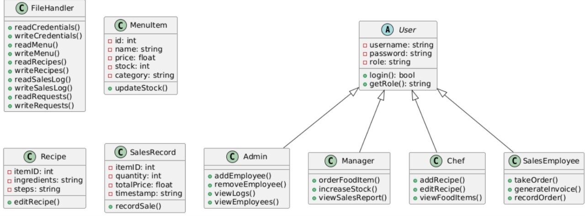

# 🍽️ Console-Based Food Management System (FMS)

## 📖 Overview

The **Food Management System (FMS)** is a **console-based C++ application** that simulates the backend operations of a mid-sized restaurant. It supports **multiple employee roles**—Admin, Manager, Chef, and Sales Employee—each with specific responsibilities. All data is persisted using **plain text files**, showcasing practical C++ concepts like **Object-Oriented Programming (OOP)** and **file handling**, without relying on external databases or GUIs.

> 🎯 This project was built as a solution to the **"Console-Based Multi-Role Food Management System"** hackathon problem statement.

---

## ✨ Features

- **Multi-Role Access Control**  
  Secure login system that redirects each user to a role-specific dashboard.

- **File-Based Data Persistence**  
  Stores user data, inventory, recipes, logs, and more using `.txt` files.

- **Admin Functionalities**  
  - Add/remove employees (Manager, Chef, Sales)
  - Real-time credential updates

- **Manager Functionalities**  
  - Request new items (processed by Chef)
  - Restock existing inventory
  - View sales reports

- **Chef Functionalities**  
  - View/approve manager item requests
  - Add/edit recipes
  - Add new items to the menu

- **Sales Functionalities**  
  - Take customer orders with a clean tabular UI
  - Stock validation before order processing
  - Generate invoices and update inventory

- **Comprehensive Logging**  
  - `activity_log.txt` for user actions  
  - `sales.txt` for timestamped sales entries

---

## 🛠️ Project Structure



The project is organized using modern C++ and OOP principles, with a clear separation of concerns.

```
/FMS_Project/
|-- main.cpp                # Main entry point of the application
|
|-- DataStructures.h        # Defines all data structs (MenuItem, User, etc.)
|
|-- Utils.h, Utils.cpp      # Helper functions (clear screen, split string)
|-- FileHandler.h, .cpp     # Handles all reading/writing to .txt files
|
|-- User.h, User.cpp        # Abstract base class for all employee roles
|-- Admin.h, Admin.cpp       # Derived Admin class and its functionalities
|-- Manager.h, Manager.cpp   # Derived Manager class and its functionalities
|-- Chef.h, Chef.cpp         # Derived Chef class and its functionalities
|-- SalesEmployee.h, .cpp    # Derived Sales Employee class and its functionalities
|
|-- FMS.h, FMS.cpp           # Core system class that orchestrates the application
|
|-- credentials.txt          # Stores user login credentials
|-- menu.txt                 # List of all food items, prices, and stock
|-- recipes.txt              # Stores recipes corresponding to menu items
|-- requests.txt             # Pending new item requests from Manager to Chef
|-- sales.txt                # Log of all sales transactions
|-- activity_log.txt         # Log of all user activities
|
|-- README.md                # This file
```

🚀 **Getting Started**

Follow these instructions to compile and run the project on your local machine.

### Prerequisites

You need a C++ compiler that supports C++11 or newer. The `g++` compiler is recommended.

* **Windows:** You can use MinGW (part of mingw-w64) or the compiler included with Visual Studio.
* **macOS:** Install Command Line Tools by running `xcode-select --install`.
* **Linux:** Install `g++` by running `sudo apt-get install build-essential` (for Debian/Ubuntu) or an equivalent command for your distribution.

### Installation & Compilation

1. **Clone or Download the Project**
   Clone this repository or download the source code files into a single directory.
2. **Navigate to the Project Directory**

   ```bash
   cd path/to/FMS_Project
   ```
3. **Compile the Code**
   Run the following command to compile all `.cpp` files and create an executable named `FMS_App`:

   ```bash
   g++ *.cpp -o FMS_App
   ```

   If you are on Windows and not using a Bash-like terminal, you might need to list the files manually:

   ```cmd
   g++ main.cpp Utils.cpp FileHandler.cpp User.cpp Admin.cpp Manager.cpp Chef.cpp SalesEmployee.cpp FMS.cpp -o FMS_App.exe
   ```

### Running the Application

* On **Linux/macOS**:

  ```bash
  ./FMS_App
  ```
* On **Windows**:

  ```cmd
  FMS_App.exe
  ```

🧑‍🍳 **How to Use the System**

The application will launch, and you will be prompted to log in. You can use the pre-filled credentials to test each role.

**Sample Login Credentials**

| Role           | Username   | Password  |
| -------------- | ---------- | --------- |
| Admin          | admin      | admin123  |
| Manager        | managerAli | passAli   |
| Chef           | chefAfaq   | passAfaq  |
| Sales Employee | salesBhatti| passBhatti|

**Example Workflows**

* **Admin:** Log in as `admin`. Choose option 1 to add a new employee, then choose option 3 to see them on the list.
* **Manager:** Log in as `managerAli`. Choose option 2 to increase the stock of "Fish and Chips" (ID 7), which is critically low. Then, choose option 3 to view the sales report.
* **Chef:** Log in as `chefAfaq`. Choose option 1 to process the pending requests for "Club Sandwich" and "Fresh Lime". You will be prompted to add their recipes.
* **Sales Employee:** Log in as `passBhatti`. Choose option 1 to take a new order. Notice that "Special Soup" (ID 8) is not displayed because it is out of stock. Add a few items to an order and see the final invoice. After the order, the stock levels in `menu.txt` will be updated.

To exit a user's dashboard and return to the login screen, choose the "Logout" option from their menu. To exit the application entirely, choose "Exit" from the login screen.
